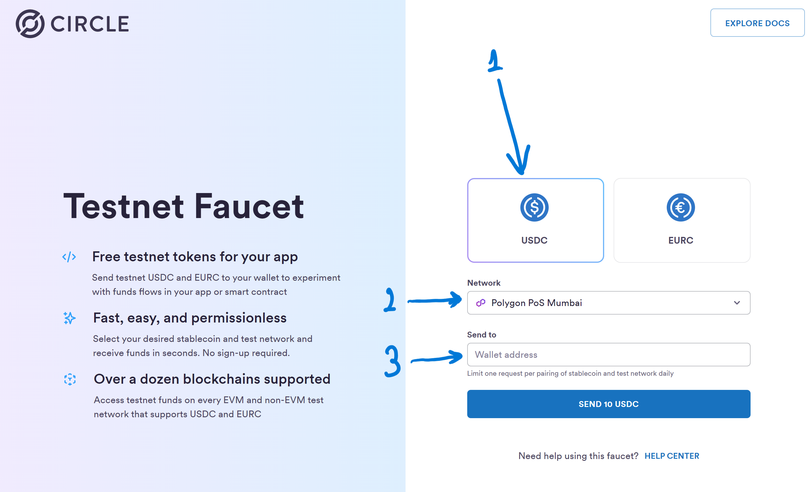

# Getting Test USDC

Getting test USDC is really easy.

- Go to the website `https://faucet.circle.com/?_gl=1*hd1wlt*_ga_GJDVPCQNRV*MTcwNjYzMzIxNi4yLjEuMTcwNjYzMzcxMC42MC4wLjA.`

1. Be sure that `USDC` option is chosen and not the EURC option.

2. The network will be blockchain network that you have obtained in the last lesson. If you are following the tutorial then it should be `Polygon PoS Mumbai` (which is `MATIC-MUMBAI`).

3. In the `send to` box, enter your wallet address that you have obtained in the last section.

- Finally click to send button.

Here is the example screen shot with the 3 parts that are explained above:

In the next lesson, you will be checking if you got the tokens!
